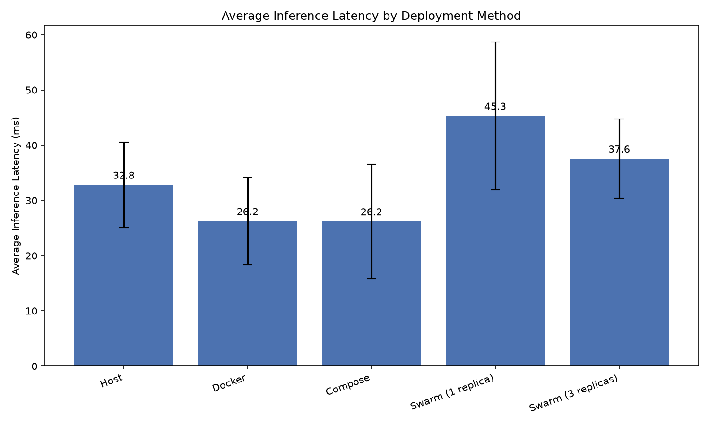
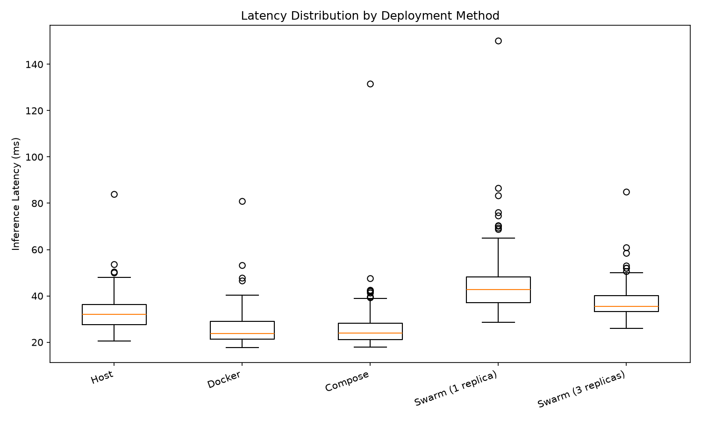

# Dockerize Flask Application — LLM Inference Benchmarking Across Docker, Compose & Swarm

A hands-on cloud infrastructure project benchmarking the performance of an LLM-based sentiment analysis service across four deployment strategies: running directly on a host machine, a single Docker container, Docker Compose, and Docker Swarm (with horizontal scaling to 3 replicas).

## Overview

This project containerizes a Flask-based sentiment analysis inference service (using HuggingFace's `distilbert-base-uncased-finetuned-sst-2-english` model) and systematically measures inference latency across four deployment configurations to understand the real-world performance trade-offs of each containerization/orchestration approach.

**Deployment methods compared:**
1. **Host** — running the Flask app directly on the machine (baseline)
2. **Docker** — a single containerized instance
3. **Docker Compose** — declarative single-service orchestration
4. **Docker Swarm** — service orchestration with 1 and 3 replicas, load-balanced via Swarm's routing mesh

Each stage sends the same 160 HTTP requests (via `latency_test.sh`) covering short phrases, long paragraphs, and mixed-sentiment text, and logs per-request inference latency to a CSV file.

## Project Structure

```
homeworks/one/
├── app.py                  # Flask inference service with latency logging
├── Dockerfile               # Image build spec (model is pre-downloaded/baked at build time)
├── docker-compose.yml       # Compose service definition (host networking)
├── requirements.txt         # Python dependencies (torch CPU build, transformers, flask)
├── latency_test.sh          # Sends 160 varied POST requests to /infer
├── analyze_results.py       # Loads all result CSVs, computes stats, generates comparison plots
└── results/                 # All raw latency data, summary stats, and generated plots
```

## How It Works

`app.py` exposes a single endpoint, `POST /infer`, which accepts `{"text": "..."}`, runs it through the sentiment model, and returns the predicted label. Every request's latency (measured strictly around the model inference call, excluding model load time), prediction, input text, and timestamp are appended to a CSV file, whose name is configurable via the `METRICS_LOG_FILE` environment variable — this lets each deployment stage log to a distinct file for later comparison.

## Results

### Latency Summary (milliseconds, over 160 requests per stage)

| Method              | Mean  | Median | Std Dev | Min   | Max    |
|---------------------|-------|--------|---------|-------|--------|
| Host                | 32.81 | 31.97  | 7.73    | 20.58 | 83.86  |
| Docker              | 26.23 | 23.76  | 7.89    | 17.79 | 80.83  |
| Compose             | 26.19 | 24.04  | 10.33   | 17.92 | 131.64 |
| Swarm (1 replica)   | 45.31 | 42.82  | 13.39   | 28.64 | 150.13 |
| Swarm (3 replicas)  | 37.57 | 35.48  | 7.15    | 26.05 | 84.95  |




*Note: CPU%, Memory%, and Network I/O were observable via `docker stats` during testing but were not systematically captured across all runs in this iteration — this is a known limitation of the current dataset.*

### Analysis

**Docker and Compose perform virtually identically** (~26ms average), which makes sense: Compose doesn't introduce a new execution engine, it's a declarative wrapper around the same Docker Engine. Compose showed slightly higher variance (std dev 10.33 vs 7.89), likely attributable to the `network_mode: host` configuration used to work around network restrictions (see *Notable Engineering Decisions* below).

**Host was slightly slower than Docker/Compose** (32.81ms vs ~26ms) — counter to the naive expectation that direct execution should be fastest. This is best explained by the lack of resource isolation on the host: the Flask process competes with every other running process on the machine for CPU time, whereas containers run in a comparatively more isolated environment. An initial test run showed a large outlier (388.99ms) that turned out to be a data-collection artifact (two test runs accidentally concatenated into one file); after re-running with clean data collection, latency was stable and consistent with this explanation.

**Swarm with 1 replica was the slowest configuration** (45.31ms) — Swarm builds a virtual overlay network for its services, which adds routing overhead even with a single replica, before any of the benefits of load distribution can offset that cost.

**Swarm with 3 replicas improved significantly over 1 replica** (37.57ms) and had the **lowest standard deviation of all methods** (7.15) — the most consistent/predictable latency of any configuration. This demonstrates Swarm's core value proposition: distributing load across replicas smooths out per-request variance, even though the underlying per-request overhead (compared to a bare Docker container) is still present.

### Pros & Cons

| Method | Pros | Cons |
|---|---|---|
| **Host** | Simplest setup, no extra tooling | No isolation from other system processes → less predictable performance; dependency management is manual and environment-specific |
| **Docker** | Fastest and most consistent for a single service; portable, reproducible environment | No built-in scaling or self-healing; manual container lifecycle management |
| **Docker Compose** | Declarative, reproducible multi-container config; easy to version-control | Performance is essentially identical to raw Docker — its value is operational, not performance-related |
| **Docker Swarm** | Built-in load balancing, horizontal scaling, and self-healing (failed replicas are automatically replaced) | Overlay network introduces latency overhead; added operational complexity not justified for simple, low-scale workloads |

## Notable Engineering Decisions & Challenges

Several deviations from a "textbook" setup were necessary due to internet filtering restrictions in the deployment environment (Iran), where Docker Hub, PyPI, `download.pytorch.org`, and HuggingFace all require a VPN or mirror to reach reliably. These are documented here in the interest of transparency:

- **`docker-compose.yml` uses `network_mode: host`** instead of standard port mapping (`8080:5000`). With the default Docker bridge network, containers could not route through the host's VPN tunnel to reach HuggingFace — using host networking resolved this. As a side effect, Compose tests were run against port `5000` rather than `8080`.
- **The sentiment model is pre-downloaded ("baked") into the Docker image at build time** (via an extra `RUN python -c "from transformers import pipeline; ..."` step in the Dockerfile), rather than being downloaded at container startup. This was necessary because Docker Swarm's overlay network intermittently failed to resolve DNS for HuggingFace at runtime — baking the model in removes any runtime dependency on external network access, and has no effect on the measured inference latency (which only times the actual model inference call, not model loading).
- A Docker Hub registry mirror (ArvanCloud) and manual DNS servers were configured in `/etc/docker/daemon.json` to improve reliability of image pulls under network restrictions.

## Running It Yourself

```bash
cd homeworks/one
python3 -m venv venv && source venv/bin/activate
pip install -r requirements.txt

# Host baseline
python app.py &
sh ./latency_test.sh 127.0.0.1 5000

# Docker
docker build -t llm-inference-image .
docker run -d --name llm-inference-container -p 5000:5000 llm-inference-image
sh ./latency_test.sh 127.0.0.1 5000

# Compose
docker compose up -d
sh ./latency_test.sh 127.0.0.1 5000

# Swarm
docker swarm init
docker service create --name llm-inference-service --publish 8080:5000 llm-inference-image:latest
sh ./latency_test.sh 127.0.0.1 8080
docker service scale llm-inference-service=3
sh ./latency_test.sh 127.0.0.1 8080

# Analysis
python analyze_results.py
```

## Author

Taha Abolhasani — Computer Engineering student, aspiring Cloud Engineer.
